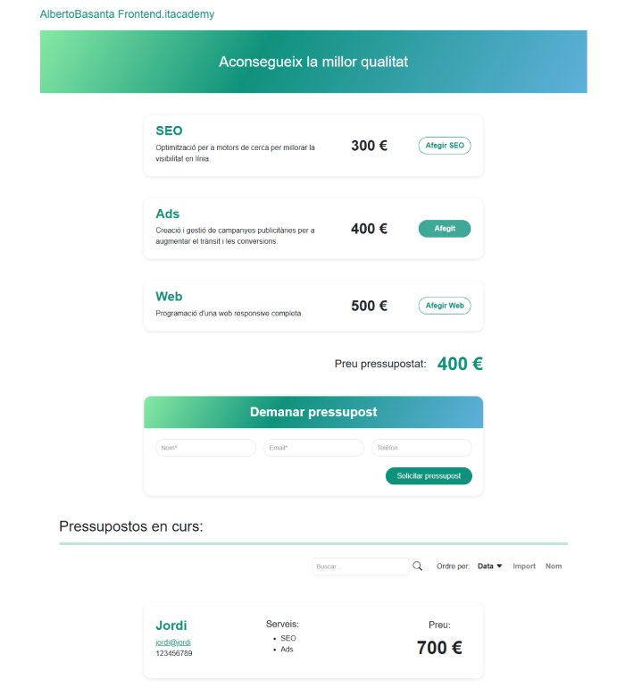

# S6.- Pressupostos (Angular)

<p align="center">
  
</p>

## 📄 Descripción

Este repositorio contiene una aplicación de **gestión de presupuestos** desarrollada con **Angular**. Permite a los usuarios generar presupuestos dinámicos, guardarlos y organizarlos según diferentes criterios.

## ✨ Características

- **Formulario Dinámico**: Permite la creación de presupuestos interactivos con opciones personalizadas.
- **Lista de Presupuestos Guardados**: Se pueden almacenar y gestionar múltiples presupuestos.
- **Ordenación Avanzada**: La lista de presupuestos puede ordenarse por **fecha, nombre y precio**, tanto de forma ascendente como descendente.
- **Generación de URL Dinámica**: Cada presupuesto genera una URL única para facilitar su **compartición y recuperación**.
- **Interfaz Responsiva**: Adaptada para su uso en **dispositivos móviles y de escritorio**.

## 💻 Tecnologías Utilizadas

- **Angular CLI** version 19.0.7.
- **Bootstrap 5.3** para el diseño y la maquetación.
- **Bootstrap Icons** para los iconos.
- **HTML5**
- **TypeScript**
- **SCSS**

## 📋 Requisitos

- **Node.js** y **npm** instalados en tu sistema. Descárgalos desde [nodejs.org](https://nodejs.org/).
- Angular CLI instalado globalmente:
  ```bash
  npm install -g @angular/cli
  ```

## 🛠️ Instalación

### **✔️ Requisitos previos**
Asegúrate de tener **Node.js** instalado en tu sistema. Puedes descargarlo desde [nodejs.org](https://nodejs.org/).  
ℹ️ **No es necesario instalar Angular CLI globalmente**, ya que se instalará automáticamente con las dependencias del proyecto.

### **✔️ Instalación paso a paso**

**1️⃣ Clona este repositorio en tu máquina local:**
```bash
git clone https://github.com/basantades/S6.-Pressupostos-Angular.git
```

**2️⃣ Ingresa al directorio del proyecto:**
```bash
cd S6.-Pressupostos-Angular
```

**3️⃣ Instala las dependencias necesarias:**
```bash
npm install
```

Esto instalará todas las dependencias necesarias, incluyendo Angular CLI.

## ▶️ Ejecución

Para iniciar la aplicación en un entorno de desarrollo, ejecuta:
```bash
ng serve
```
Luego, abre tu navegador y navega a `http://localhost:4200/` para ver la aplicación en acción.

## 🤝 Contribuciones

Si deseas colaborar en este proyecto o reportar algún problema, sigue estos pasos:

1. Crea un **issue** para reportar errores o sugerir mejoras.
2. Envía un **pull request** con tus contribuciones.
3. Asegúrate de seguir las **buenas prácticas** de desarrollo y de probar tus cambios antes de enviarlos.

---

Este README proporciona una guía básica para configurar, utilizar y contribuir al proyecto **S6.- Pressupostos (Angular)**. Asegúrate de consultar la documentación oficial de Angular y Bootstrap para obtener información más detallada y actualizaciones.

